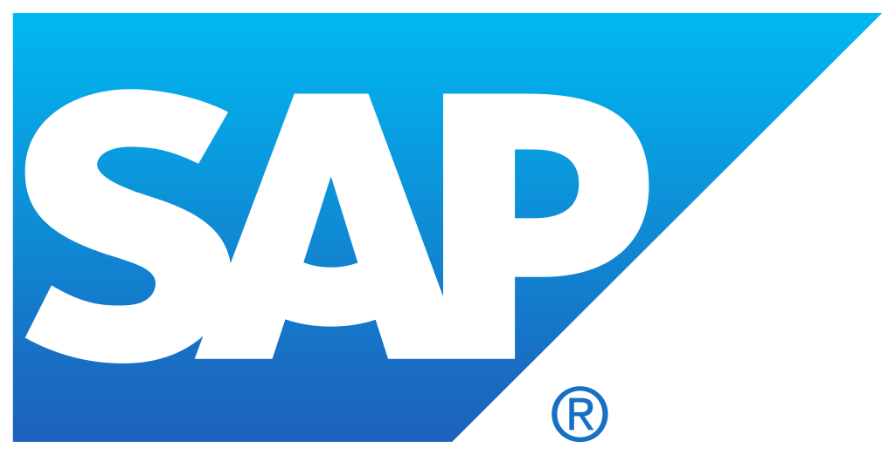
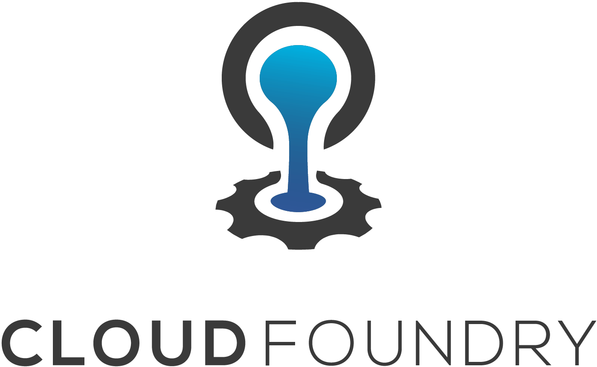

## Internship at SAP - A recap

Georgi Bozhinov, 2018

---
@transition[none]

@snap[north]
### Tech
@snapend

@snap[west sidebar]

@snapend

@snap[east sidebar]

@snapend

- Variety of work
- Lots of tech
- Lots to learn
- Lots of libraries

---
@transition[none]

@snap[north]
### Tech
@snapend

@snap[west sidebar]
 
@snapend

@snap[east sidebar]

@snapend

- Cloud platforms
- Docker + containers
- On-premise concepts
- Intro and diving into Kubernetes

---

### Tech

- New and exciting tech
- Great opportunity for research

---

### Organization

- Weekly meetings with manager + feedback
- Onboarding from company
- Onboarding from team
- Helpful people
- Lots of things to process

---

### Expectations

- Work on interesting stuff
- Work with a good team as promised
- Great office accomodations
